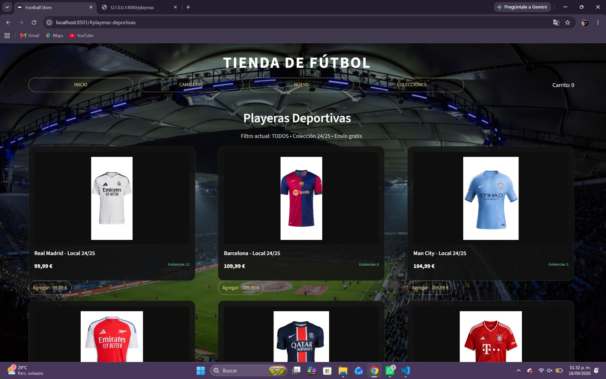
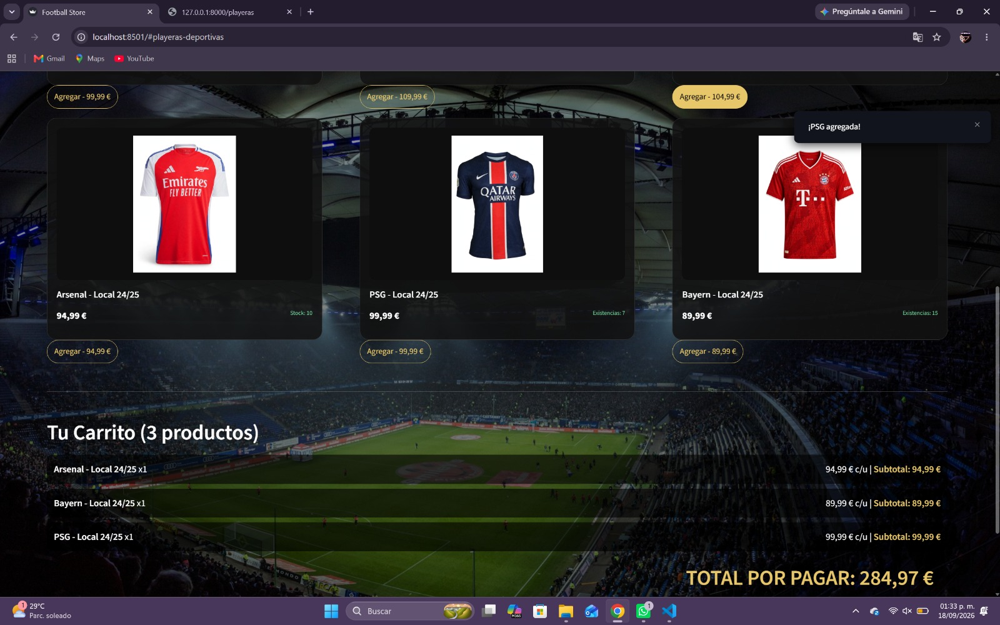
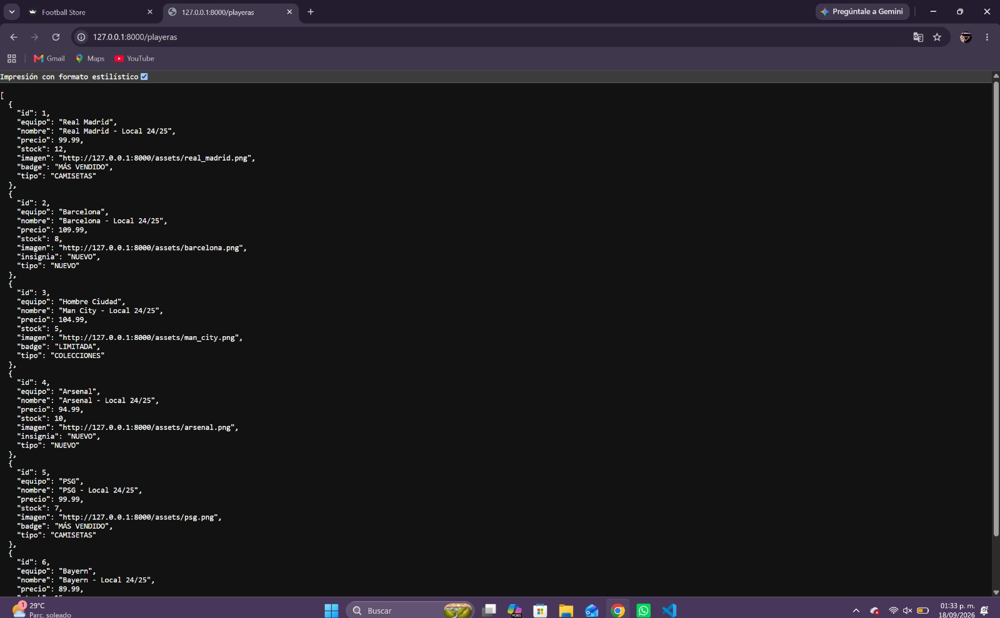

# Examen de unidad 1 - Programación Web
Desarrollado por: [ESTRELLA RAMIREZ DE LA CRUZ]
Profesor: José Arturo Bustamante Lazcano
Materia: Programación Web 2026

## Descripción
Tienda de playeras de fútbol temporada 24/25.
Se consume una API propia hecha con FastAPI que contiene 6 equipos: Real Madrid, Barcelona, Man City, Arsenal, PSG y Bayern.

## Ejemplo del código
Este es el código principal de la aplicación, igual al del ejemplo del profesor.

```python
import requests
import streamlit as st
import base64

# Inicializar el estado de la página si no existe
if "page" not in st.session_state:
    st.session_state.page = 1
if "carrito" not in st.session_state:
    st.session_state.carrito = []
if "filtro" not in st.session_state:
    st.session_state.filtro = "TODOS"

def consumir_api():
    response = requests.get("http://127.0.0.1:8000/playeras")
    data = response.json()
    return data

playeras = consumir_api()
```

## Ejemplo de la interfaz
Interfaz corriendo en Streamlit con fondo de estadio.



## Carrito con cantidad y total
Se muestra x1, subtotal y TOTAL POR PAGAR con el diseño extra.



## Ejemplo del Api Consumida
API propia creada con FastAPI. Endpoint: http://127.0.0.1:8000/playeras

